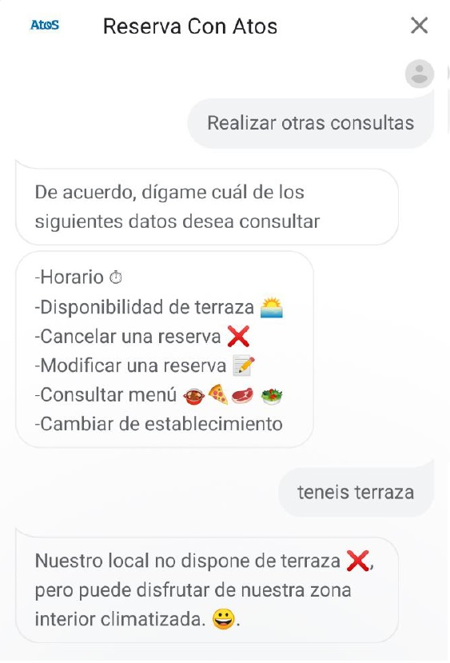

# **Reservation Covid Bot**

Is a chat/voice bot 🤖 for Booking at restaurants 🍽️ ready for the "New normality" ✔️

## **Table of contents**

- [**Reservation Covid Bot**](#reservation-covid-bot)
  - [**Table of contents**](#table-of-contents)
  - [**General info**](#general-info)
  - [**Demo**](#demo)
  - [**Screenshots**](#screenshots)
  - [**Technologies**](#technologies)
  - [**Setup**](#setup)
    - [Developer mode (local webhook)](#developer-mode-local-webhook)
    - [Production Mode (webhook @firebase functions)](#production-mode-webhook-firebase-functions)
  - [**Usage**](#usage)
  - [**Status**](#status)
  - [**Contact**](#contact)

## **General info**

**Date**: May, 2020  
**Duration**: 1 Month.  
**Team members**: [**@Emmanuel**](https://www.linkedin.com/in/emagleza/), **@Fernando** and [**@Omar**](https://www.linkedin.com/in/omar-bennedjma-093a72196/).

This project has been the result of the FCT practices that we have carried out remotely 👨‍💻 in ATOS and it has been quite a challenge, since it has been a project started from scratch in new technologies for us (Node, Firebase, DialogFlow, etc) and with carte blanche in practically everything, since the only rule was to use the technologies discussed above and meet the deadlines for the bot.

The most important thing about the bot is that it is completely autonomous and that in addition to taking into account the basic things of the reservations, it also contemplates those added by the "new normal", so when you make a reservation, the bot will take into account its own schedule in case it is closed at that time, its capacity limitation both inside and outside (including extra limitation depending on the phase it is in), maximum number of people per groups and other things. Although the most important thing is that in case the indicated date was already reserved, it will automatically offer you similar options to continue with the "Happy Path" and make your reservation.

## **Demo**

Unfortunately, right now we don't have an interactive demo that can be tested, since to avoid expenses we have deactivated the project in Firebase and DialogFlow, but if you follow the steps of the Setup you can assemble it yourself and test it.

But we do have visual content of the project working so you can see the functionalities that it has.

> <br><i>Demo</i>

You can download the full video with sound from this [**Link**](https://github.com/udsgit/reservation-covid-bot/blob/master/readme/demo.m4v)

## **Screenshots**

> 
> 
> 
> 
> 
> <br><i>Bot query examples</i>

## **Technologies**

- **JavaScript**
- [**Node JS**](https://nodejs.org/es/)&nbsp;&nbsp;_(Webhook)_
- [**Express JS**](https://expressjs.com/)&nbsp;&nbsp;
- [**DialogFlow**](https://dialogflow.cloud.google.com/)&nbsp;&nbsp;_(Conversational AI)_
- [**Firebase**](https://firebase.google.com/)&nbsp;&nbsp;_(Functions & Database)_
- **Libraries**
  - [**Dialogflow-fulfillment**](https://cloud.google.com/dialogflow/docs/fulfillment-overview)
  - [**Actions-on-google**](https://developers.google.com/assistant)&nbsp;&nbsp;_(Google Assistant)_
  - [**Firebase-functions**](https://firebase.google.com/docs/functions)
  - [**Googleapis**](https://developers.google.com/calendar)&nbsp;&nbsp;_(For the Calendar)_
  - **And other little libraries...**

## **Setup**

There are 2 types of installations, the one of the developer mode (recommended) to have the local webhook with testing/debug and the other is for when the project is in production deployed in firebase

### Developer mode (local webhook)

1. Clone/Download the repository.

```console
git clone https://github.com/udsgit/reservation-covid-bot.git
```

2. Move to the functions folder.

```console
cd functions
```

3. Install the packages.

```console
npm install
```

4. Edit the files at **_"/functions/credentials"_** and change it for your Google Calendar credentials (owner) and Firebase (admin) (For this step you will add 2 new credentials account at Google Cloud).

5. Init the local server.

```console
npm run dev
```

6. Open another console and move again to the function folder.

```console
npm run tunnel
```

7. The previous command will provide us with an HTTPS link from our local server already deployed and valid for 8 hours (In case the time expires, restart the command again) \*_Remember that the link is different with each restart_.

8. Copy the HTTPS link, enter the DialogFlow website, import the file "agent.zip" from the repository.

9. And in the Fulfillment tab paste the link and add "/dialogflow" like the following example.

```console
https://9cbb5915b7e7.ngrok.io/dialogflow)

```

10. Now you just need to create the database at Firebase Realtime Database (locally or not) and import the file firebase-database.json. \*_Important, you must add the calendar Id in the JSON file of the db_.

11. Finally now you can test it.

### Production Mode (webhook @firebase functions)

1. After first having the service running locally following the previous steps, you only have to change small things to move it to production.

2. Open console window and move to "/" out of the functions folder.

3. Init Firebase.

```console
firebase init
```

4. And we answer the following questions

   - Are you ready to proceed? => Yes
   - Which Firebase CLI features do you want to setup for this folder? => Select database and functions
   - Select the project => We select the previously created project when we have imported the agent at dialogflow
   - Optionally you can choose to work with JavaScript/TypeScript with ESLint, etc. (If you don't know what I mean, just choose javascript)
   - If ask for rewrite => No.
   - Install dependencies with npm => Yes.

5. Ready, now you can use the following command for deploy

```console
firebase deploy
```

6. The deployment may take more than 1 minute and when it is finished, you can already enter the Firebase website in the functions tab and copy the HTTPS url and paste it in the Fulfillment tab of Dialogflow replacing the previous one and adding "/dialogflow" to the end like the following example.

```console
https://us-central1-projectName.cloudfunctions.net/app/dialogflow
```

7. Obviously then you can change the Firebase server so that it is not so far from where the product is used.

8. And ready, now in a simple way through commands you can pass the local webhook to the cloud without changing part of the node and express code.

## **Usage**

1. For test the bot, if you was followed the previously steps you can now test it at Dialogflow console.
2. Other options to test it, is that if in the integrations tab you have enabled the deployment on other platforms such as Telegram, Messenger, etc. Then you can test it on these platforms as long as you have been able to configure it correctly.
3. The "Code" for access when you are talking with the bot is "atos".

## **Status**

Project is: **_Completed._**

Because it was a project with an end date and it has served to better understand these technologies. In case a similar project is followed, it would be good to take it into account but it would be better to start a more orderly and clean project from scratch, since tests and clean code could not be added (both due to lack of knowledge and time).

## **Contact**

Created by

- [**@Emmanuel**](https://www.linkedin.com/in/emagleza/)
- **@Fernando**
- [**@Omar**](https://www.linkedin.com/in/omar-bennedjma-093a72196/)

Feel free to contact us if you need it.
